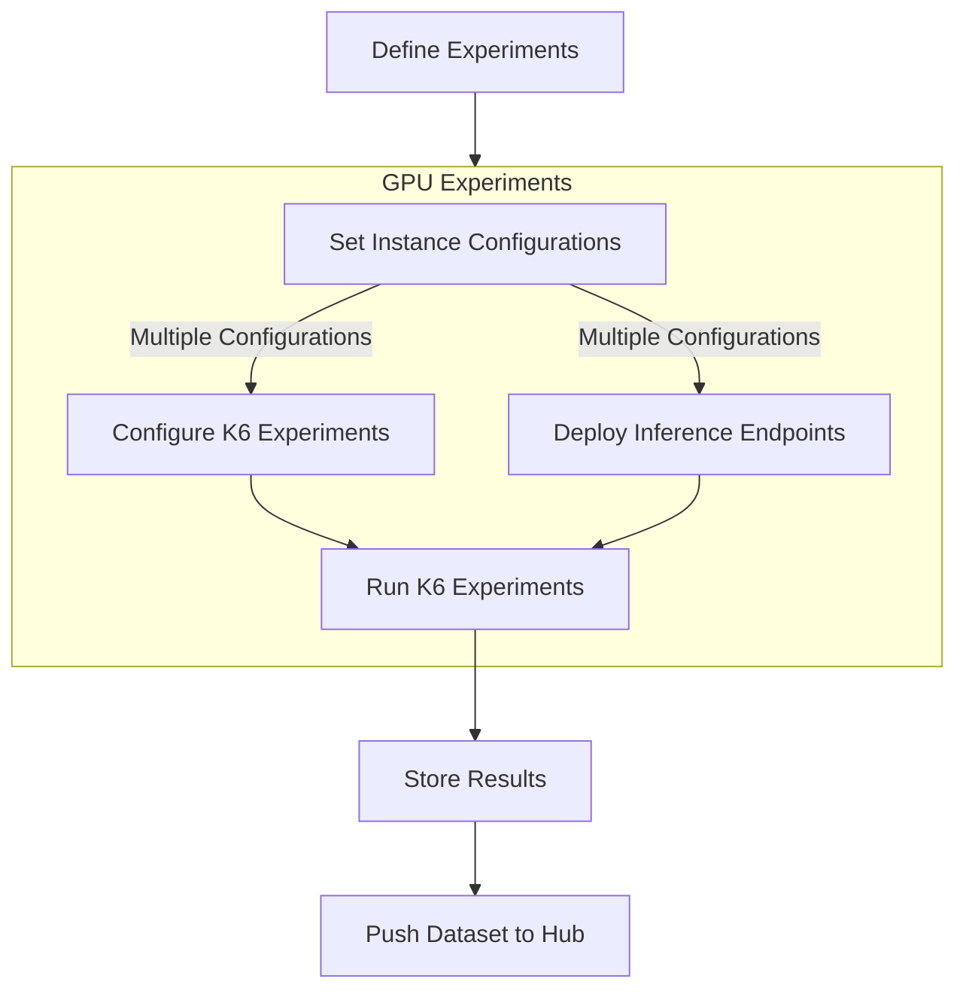

```mermaid
graph TD;
  E[Define Experiments] --> F[GPU Experiments]

  subgraph F[GPU Experiments]
    F4[Set Instance Configurations]
    F4 -->|Multiple Configurations| F5[Deploy Inference Endpoints]
    
    F4 -->|Multiple Configurations| K1[Configure K6 Experiments]
    K1 --> G[Run K6 Experiments]
    
    F5 --> G
  end
  
  G --> H[Store Results]
  H --> I[Push Dataset to Hub]
```

