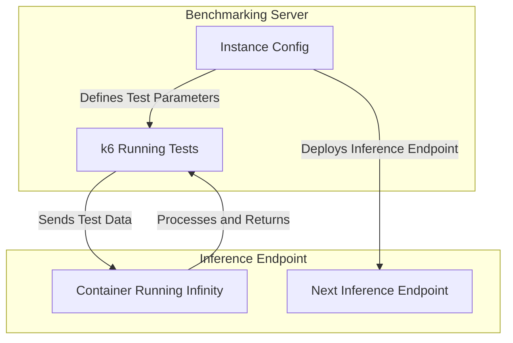

```mermaid
flowchart TD;
    subgraph Benchmarking Server
        A[k6 Running Tests]
        D[Instance Config]
    end

    subgraph Inference Endpoint
        C[Container Running Infinity]
        E[Next Inference Endpoint]
    end

    D -->|Defines Test Parameters| A
    D -->|Deploys Inference Endpoint| E
    A -->|Sends Test Data| C
    C -->|Processes and Returns| A
```

