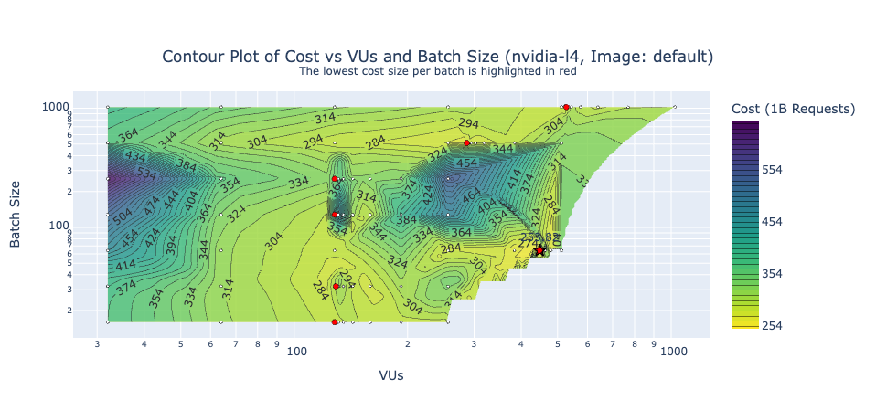
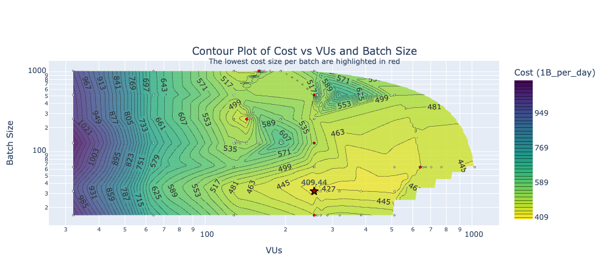
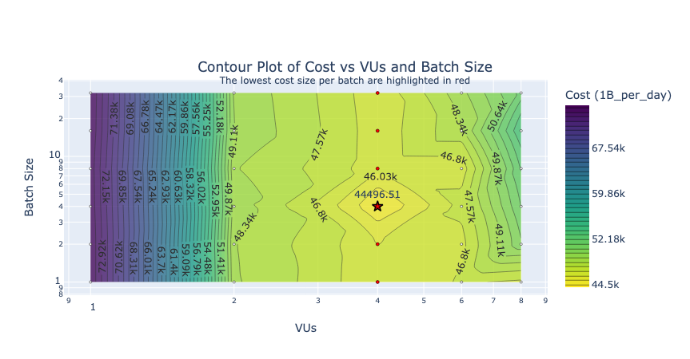
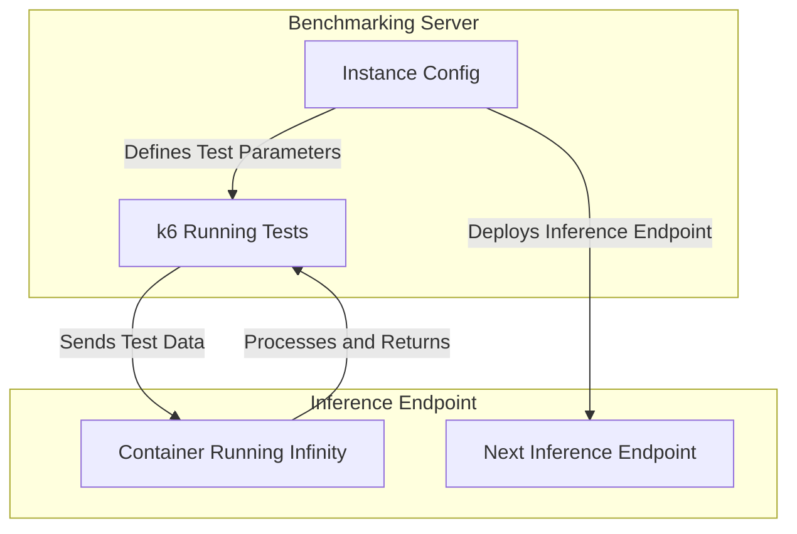

<!-- PROJECT SHIELDS -->
<!--
*** I'm using markdown "reference style" links for readability.
*** Reference links are enclosed in brackets [ ] instead of parentheses ( ).
*** See the bottom of this document for the declaration of the reference variables
*** for contributors-url, forks-url, etc. This is an optional, concise syntax you may use.
*** https://www.markdownguide.org/basic-syntax/#reference-style-links
-->
[![Contributors][contributors-shield]][contributors-url]
[![Stargazers][stars-shield]][stars-url]
[![Issues][issues-shield]][issues-url]
[![MIT License][license-shield]][license-url]

# Table of Contents
- [Introduction](#introduction)
- [Installation](#installation)
- [Getting Started](#getting-started)
- [Project Structure](#project-structure)
- [Results](#results)
- [How does it work?](#how-does-it-work)
- [References and Links](#references-and-links)

# Introduction

This repository supports a blog post that helps users estimate costs for large-scale classification, embedding, or
vision embedding tasks. It provides benchmarking tools for different GPU types, batch sizes, and inference methods,
using [michaelfeil/infinity](https://github.com/michaelfeil/infinity/)
and [Inference Endpoints](https://huggingface.co/inference-endpoints/dedicated).

I considered a variety of things like:

- GPU type
- Infinity Image type
- Varying Batch Sizes
- Varying VUs amounts
- Multiple Architectures

# Installation

I used 

1. `git clone https://github.com/datavistics/encoder-analysis.git`
2. `cd encoder-analysis`
3. `pip install -r requirements.txt`
4. `pip install jupyterlab`
5. [Install k6](https://grafana.com/docs/k6/latest/set-up/install-k6/#install-k6) based on your platform

## Getting Started

1. Run `jupyter lab`
2. First choose your task [`classification`, `embedding`, `vision-embedding`]
3. Run `<task>-optimization.ipynb` to get the best configuration
4. Run `<task>-analysis.ipynb` to get the results
5. Alternatively run `<task>-analysis-gradio.ipynb` to have more interactive results

# Project Structure

- There are notebooks in the top level for convenience. Its probably cleaner to put them in `./notebooks` but its
  annoying to add it to path, so I opted for user satisfaction rather than aesthetics
    - **\*-optimization.ipynb** - These were used for generating and conducting the experiments
    - **\*-analysis.ipynb** - These show the analysis in a clean notebook-centric way
    - **\*-analysis-gradio.ipynb** - These show the analysis in an interactive gradio-centric way
- `src` I abstracted a fair amount of code here. I tried to keep any important details in the notebooks
- `templates` these are the k6 jinja templates that I use to generate each experiment
- `data`, `generated`, and `results` are used to store non-version-controlled project files

# Results

Do check out these [notebooks](https://nbviewer.org/github/datavistics/encoder-analysis/tree/main/) in nbviewer, as I
took a lot of effort to make sure they are **interactive**. Unfortunately they look better in light mode due to the
tables.
But follow your heart.

- [classification-analysis-gradio.ipynb](https://nbviewer.org/github/datavistics/encoder-analysis/blob/main/classification-analysis-gradio.ipynb)
- [embedding-analysis-gradio.ipynb](https://nbviewer.org/github/datavistics/encoder-analysis/blob/main/embedding-analysis-gradio.ipynb)
- [vision-embedding-analysis-gradio.ipynb](https://nbviewer.org/github/datavistics/encoder-analysis/blob/main/vision-embedding-analysis-gradio.ipynb)

## Classification

For [lxyuan/distilbert-base-multilingual-cased-sentiments-student](https://huggingface.co/lxyuan/distilbert-base-multilingual-cased-sentiments-student)
on a dataset like [tyqiangz/multilingual-sentiments](https://huggingface.co/datasets/tyqiangz/multilingual-sentiments)
(using the `text` column) we can do 1 Billion classifications for only `$253.82`.

| GPU           | Image         | Batch Size | VUs     | Min Cost    |
|---------------|---------------|------------|---------|-------------|
| **nvidia-l4** | **`default`** | **64**     | **448** | **$253.82** |

[Interactive Version here](https://nbviewer.org/github/datavistics/encoder-analysis/blob/main/classification-analysis-gradio.ipynb)

## Embedding

For [Alibaba-NLP/gte-modernbert-base](https://huggingface.co/Alibaba-NLP/gte-modernbert-base) on a dataset
like [sentence-transformers/trivia-qa-triplet](https://huggingface.co/datasets/sentence-transformers/trivia-qa-triplet)
(using the `positive` column) we can do 1 Billion embeddings for only `$409.44`.

| GPU       | Batch Size | VUs | Min Cost |
|-----------|------------|-----|----------|
| nvidia-l4 | 256        | 32  | $409.44  |

[Interactive Version here](https://nbviewer.org/github/datavistics/encoder-analysis/blob/main/embedding-analysis-gradio.ipynb)

## Vision Embedding

For [vidore/colqwen2-v1.0-merged](https://huggingface.co/vidore/colqwen2-v1.0-merged) on a dataset
like [openbmb/RLAIF-V-Dataset](https://huggingface.co/datasets/openbmb/RLAIF-V-Dataset)
(using the `image` column) we can do 1 Billion ColBERT style embeddings (late interaction) on images for `$44496.51`.

| GPU       | Batch Size | VUs | Min Cost  |
|-----------|------------|-----|-----------|
| nvidia-l4 | 4          | 4   | $44496.51 |

[Interactive Version here](https://nbviewer.org/github/datavistics/encoder-analysis/blob/main/embedding-analysis-gradio.ipynb)

# How does it work?

Each of the **\*-optimization.ipynb** notebooks facilitates this structure:

1. Define the benchmarking parameters (GPU, batch size, VUs, etc)
2. Deploy the inference server (Infinity on Hugging Face Endpoints)
3. Run K6 performance tests to evaluate speed, cost, and efficiency
4. Store and visualize results for optimization

# References and Links

- [Inference Endpoints](https://huggingface.co/inference-endpoints/dedicated)
- [michaelfeil/infinity](https://github.com/michaelfeil/infinity/)
- [Infinity Swagger](https://michaelfeil.eu/infinity/0.0.75/swagger_ui/)
- [k6 Docs](https://grafana.com/docs/k6/latest/)

<!-- MARKDOWN LINKS & IMAGES -->
<!-- https://www.markdownguide.org/basic-syntax/#reference-style-links -->
[contributors-shield]: https://img.shields.io/github/contributors/datavistics/encoder-analysis.svg?style=for-the-badge
[contributors-url]: https://github.com/datavistics/encoder-analysis/graphs/contributors

[stars-shield]: https://img.shields.io/github/stars/datavistics/encoder-analysis.svg?style=for-the-badge
[stars-url]: https://github.com/datavistics/encoder-analysis/stargazers

[issues-shield]: https://img.shields.io/github/issues/datavistics/encoder-analysis.svg?style=for-the-badge
[issues-url]: https://github.com/datavistics/encoder-analysis/issues

[license-shield]: https://img.shields.io/github/license/datavistics/encoder-analysis.svg?style=for-the-badge
[license-url]: https://github.com/datavistics/encoder-analysis/blob/main/LICENSE
