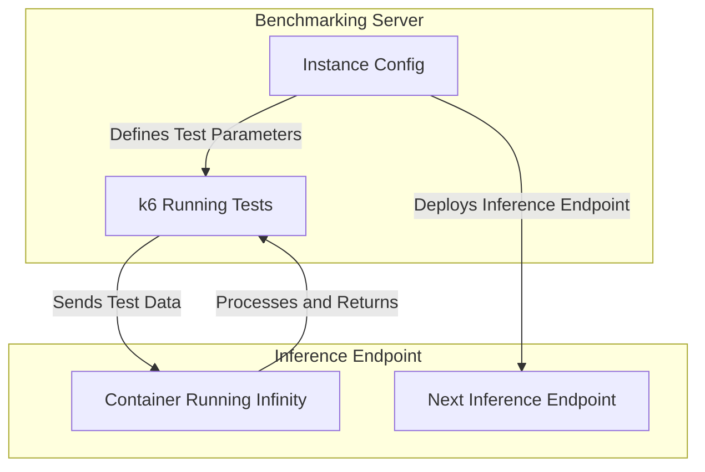

# Introduction

This repo is to support a blog to help anyone estimate the cost while optionally considering latency for large scale
classification, embedding, or vision embedding. It uses [michaelfeil/infinity](https://github.com/michaelfeil/infinity/)
and [Inference Endpoints](https://huggingface.co/inference-endpoints/dedicated). You can swap either rather easily for
your inference server and deployment method of choice.

I considered a variety of things like:

- GPU type
- Infinity Image type
- Many Batch Sizes
- Many VUs amounts
- Multiple Architectures

# Installation

I used 

1. `git clone https://github.com/datavistics/encoder-analysis.git`
2. `cd encoder-analysis`
3. `pip install -r requirements.txt`
4. `pip install jupyterlab`
5. [Install k6](https://grafana.com/docs/k6/latest/set-up/install-k6/#install-k6) based on your platform
6. `jupyter lab`
7. Run your notebook of choice

# Project Structure

- There are notebooks in the top level for convenience. Its probably cleaner to put them in `./notebooks` but its
  annoying to add it to path, so I opted for user satisfaction rather than aesthetics
    - **\*-optimization.ipynb** - These were used for generating and conducting the experiments
    - **\*-analysis.ipynb** - These show the analysis in a clean notebook-centric way
    - **\*-analysis-gradio.ipynb** - These show the analysis in an interactive gradio-centric way
- `src` I abstracted a fair amount of code here. I tried to keep any important details in the notebooks
- `templates` these are the k6 jinja templates that I use to generate each experiment
- `data`, `generated`, and `results` are used to store non-version-controlled project files

# Results

Do check out these [notebooks](https://nbviewer.org/github/datavistics/encoder-analysis/tree/main/) in nbviewer, as I
took a lot of effort to make sure they are interactive. Unfortunatelythey look better in light mode due to the tables.
But follow your heart.

- [classification-analysis-gradio.ipynb](https://nbviewer.org/github/datavistics/encoder-analysis/blob/main/classification-analysis-gradio.ipynb)
- [embedding-analysis-gradio.ipynb](https://nbviewer.org/github/datavistics/encoder-analysis/blob/main/embedding-analysis-gradio.ipynb)
- [vision-embedding-analysis-gradio.ipynb](https://nbviewer.org/github/datavistics/encoder-analysis/blob/main/vision-embedding-analysis-gradio.ipynb)

# How does it work?
Each of the **\*-optimization.ipynb** notebooks facilitates this structure:

# References and Links
- [Inference Endpoints](https://huggingface.co/inference-endpoints/dedicated)
- [michaelfeil/infinity](https://github.com/michaelfeil/infinity/)
- [Infinity Swagger](https://michaelfeil.eu/infinity/0.0.75/swagger_ui/)
- [k6 Docs](https://grafana.com/docs/k6/latest/)
